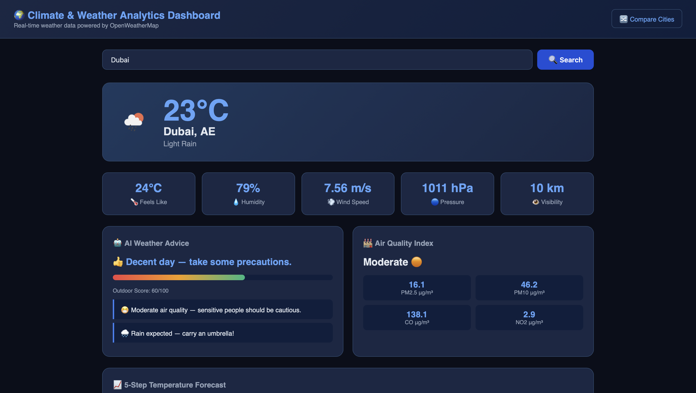
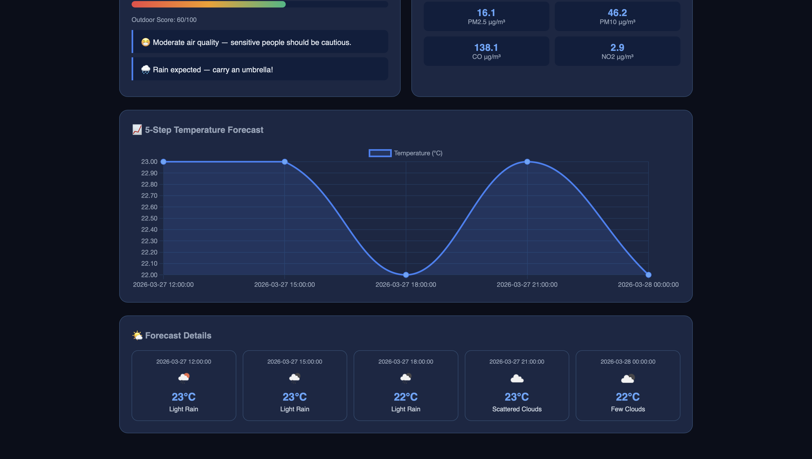
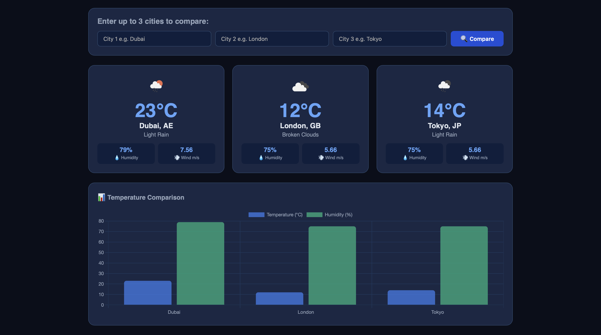

# 🌍 Climate & Weather Analytics Dashboard

A real-time climate and weather analytics dashboard built with Django and OpenWeatherMap API. Features AI-powered outdoor advice, Air Quality Index tracking, multi-city comparison, and interactive forecast charts.

## Author
Yasmeen Azmat Ali
MSc Artificial Intelligence
University of West London

## Project Overview
This project implements a full-stack weather analytics dashboard that fetches live weather data, analyzes air quality, provides AI-based outdoor recommendations, and allows comparison of multiple cities side by side.

## Features
- Real-time weather data for any city worldwide
- AI Weather Advice with outdoor score (0-100)
- Air Quality Index (AQI) with PM2.5, PM10, CO, NO2
- 5-step temperature forecast with interactive chart
- Multi-city comparison with bar charts
- Responsive dark-mode UI

## Screenshots

### Main Dashboard


### AI Weather Advice & AQI


### Multi-City Comparison


## Technologies Used
- Python 3.13
- Django 6.0
- OpenWeatherMap API
- Chart.js
- HTML5 / CSS3
- REST APIs

## Getting Started

### 1. Clone the repository
```
git clone https://github.com/yasmeenmh90-beep/climate-weather-dashboard.git
cd climate-weather-dashboard
```

### 2. Create virtual environment
```
python3 -m venv venv
source venv/bin/activate
```

### 3. Install dependencies
```
pip install django requests
```

### 4. Add your API key
Open weather/views.py and replace API_KEY with your OpenWeatherMap API key

### 5. Run the server
```
python manage.py runserver
```

### 6. Open in browser
```
http://127.0.0.1:8000
```

## API Used
OpenWeatherMap API (Free tier)
- Current Weather API
- 5-Day Forecast API
- Air Pollution API

## Future Work
- Historical weather trends
- Email weather alerts
- More cities comparison
- Temperature unit toggle (C/F)

## License
This project is for portfolio and academic purposes.
